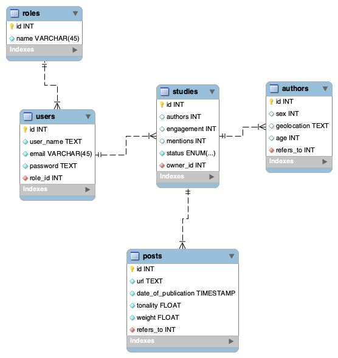

# Проєктування бази даних

## Модель бізнес-об'єктів

@startuml

entity Status
entity Grabbing
entity Pending
entity Done
entity Canceled

entity Author
entity Author.id
entity Author.sex
entity Author.geolocation
entity Author.age

entity Post
entity Post.id
entity Post.url
entity Post.date_of_publication
entity Post.weight
entity Post.tonality

entity Study
entity Study.id
entity Study.mentions
entity Study.authors
entity Study.engagement

entity User
entity User.email
entity User.password
entity User.id
entity User.user_name

entity Role
entity Role.name
entity Role.id

Post *-- Post.id
Post *-- Post.url
Post *-- Post.date_of_publication
Post *-- Post.weight
Post *-- Post.tonality

User *-- User.email
User *-- User.password
User *-- User.id
User *-- User.user_name

Role *-- Role.id
Role *-- Role.name

Author *-- Author.id
Author *-- Author.sex
Author *-- Author.geolocation
Author *-- Author.age

Study *-- Study.id
Study *-- Study.mentions
Study *-- Study.authors
Study *-- Study.engagement

Grabbing -u-|> Status
Pending -u-|> Status
Done -u-|> Status
Canceled -u-|> Status

User "0,*" -- "1,1" Role 
User "1,1" -- "0,*" Study
Study "1,1" -- "0,*" Post
Study "1,1" -- "0,*" Author
Study "1,1" -- "0,1" Status

@enduml

## ER-модель
@startuml 

entity Role  {
  id: INT 
  name: TEXT 
}

entity User { 
  id: INT 
  email: TEXT 
  password: TEXT 
  user_name: TEXT  
}

entity Study  {  
  id: INT  
  mentions: INT
  authors: INT
  engagement: INT
}

entity Post {
  id: INT
  url: TEXT
  date_of_publication: DATETIME
  weight: FLOAT
  tonality: FLOAT
}

entity Status <<ENUMERATION>>{
  Grabbing,
  Pending,
  Canceled,
  Done
}

entity Author {
  id: INT
  sex: INT
  geolocation: TEXT
  age: INT
}

Role "1, 1" <-- "0, *" User  
User "1, 1" <-- "0, *" Study
Study "1, 1" <-- "0, *" Post
Study "1, 1" <-- "0, *" Author
Study "1,1" <-- "0,1" Status

@enduml

## Реляційна схема

  

