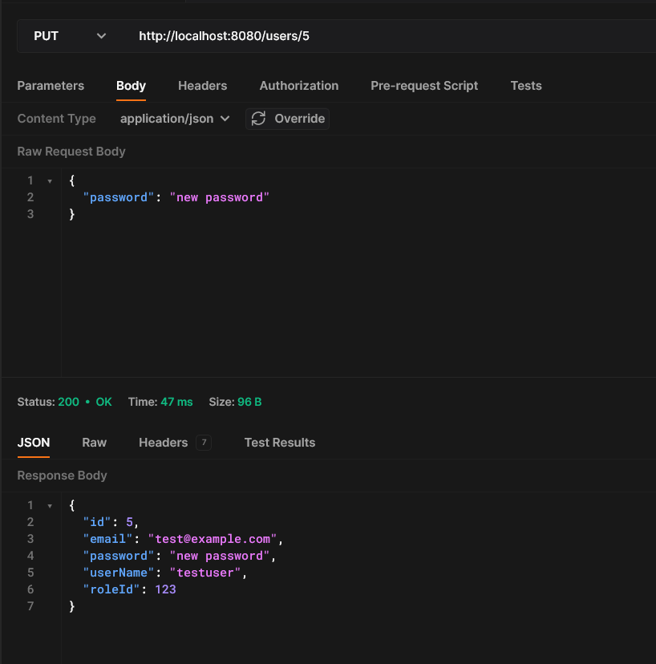

# Тестування працездатності системи

## • Створення користувача

## • Створення користувача (адміністратора)

## • Список користувачів

## • Пошук користувача за ідентифікатором

## • Зміна даних користувача

## • Перевірка що зміни збереглись

## • Пошук неіснуючого користувача

## • Видалення користувача

## • Перевірка що користувач видалений

